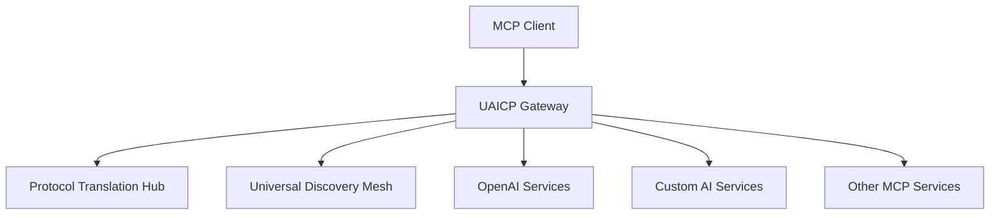

# MCP Integration Guide

This guide provides step-by-step instructions for integrating UAICP with Anthropic's Model Context Protocol (MCP). MCP provides rich semantic context and tool management capabilities that UAICP extends through universal discovery and cross-protocol translation.

## Integration Overview

### MCP + UAICP Architecture



### Key Benefits

- **🔍 Enhanced Discovery**: Extend MCP's tool discovery across all protocols
- **🌉 Protocol Bridge**: Enable MCP tools to work with non-MCP AI services  
- **🎯 Capability Matching**: Match MCP's rich capabilities with other protocols
- **📝 Context Preservation**: Maintain MCP's context semantics across boundaries

## Quick Start

### Installation

```bash
# Install MCP SDK
npm install @anthropic-ai/mcp-sdk

# Install UAICP Client Library
npm install @uaicp/client-sdk

# Install MCP-UAICP Bridge
npm install @uaicp/mcp-bridge
```

### Basic Setup

```typescript
import { MCPServer } from '@anthropic-ai/mcp-sdk/server';
import { UAICPBridge } from '@uaicp/mcp-bridge';

// Create enhanced MCP server with UAICP capabilities
const server = new MCPServer({
  name: "enhanced-mcp-server",
  version: "1.0.0"
});

// Initialize UAICP bridge
const bridge = new UAICPBridge({
  discoveryEndpoint: "https://discovery.uaicp.org",
  enableCrossProtocol: true
});

// Connect MCP server to UAICP ecosystem
await bridge.connectMCPServer(server);

// Now your MCP server can discover and use services from any protocol!
```

## Service Registration

### Register MCP Service with UAICP

```typescript
import { ServiceDescription } from '@uaicp/client-sdk';

const serviceDescription: ServiceDescription = {
  "@context": "https://uaicp.org/schema/v1.0",
  "serviceId": "financial-analysis-mcp",
  "provider": {
    "name": "Your Company",
    "type": "enterprise"
  },
  "protocolType": "mcp",
  "protocolVersion": "1.0",
  "capabilities": {
    "modalities": ["text"],
    "maxContextLength": 200000,
    "streamingSupport": true,
    "specificFeatures": [
      "tool_calling",
      "context_management", 
      "financial_analysis"
    ],
    "domainSpecialization": ["finance", "accounting"]
  },
  "endpoint": "http://localhost:3000/mcp"
};

await bridge.registerService(serviceDescription);
```

## Cross-Protocol Tool Discovery

### Enhanced Tool Discovery

```typescript
class EnhancedMCPServer {
  private bridge: UAICPBridge;

  async listTools(): Promise<Tool[]> {
    // Get native MCP tools
    const nativeTools = await this.getNativeMCPTools();
    
    // Discover tools from other protocols via UAICP
    const crossProtocolTools = await this.bridge.discoverTools({
      capabilities: ['text-analysis', 'data-processing'],
      protocols: ['openai', 'anthropic', 'custom'],
      excludeProtocols: ['mcp'] // Avoid duplicates
    });
    
    // Merge all available tools
    return [...nativeTools, ...crossProtocolTools];
  }

  async executeTool(name: string, arguments: any): Promise<any> {
    if (this.isNativeMCPTool(name)) {
      return await this.executeNativeTool(name, arguments);
    } else {
      // Execute cross-protocol tool via UAICP
      return await this.bridge.executeCrossProtocolTool(name, arguments);
    }
  }
}
```

### Context-Aware Discovery

```typescript
// Discover services based on conversation context
const services = await bridge.discoverServicesForContext({
  context: mcpContext,
  requirements: {
    domain: 'finance',
    complexity: 'high',
    dataTypes: ['financial_statements', 'market_data']
  }
});

console.log(`Found ${services.length} context-appropriate services`);
```

## Protocol Translation

### Automatic MCP ↔ OpenAI Translation

```typescript
// MCP tool call → OpenAI function call
const mcpToolCall = {
  type: 'tool_call',
  tool: {
    name: 'analyze_financial_statement',
    arguments: { statement: 'balance_sheet.json' }
  }
};

// Automatically translated to OpenAI format when routing to OpenAI service
const openAICall = await bridge.translateCall(mcpToolCall, 'openai');
// Result: { role: 'assistant', tool_calls: [{ function: { name: '...', arguments: '...' }}]}
```

### Context Preservation

```typescript
// MCP context is preserved when routing to other protocols
const result = await bridge.executeWithContext({
  toolCall: mcpToolCall,
  context: mcpContext,
  targetProtocol: 'openai'
});

// Context metadata is automatically injected into the target protocol format
```

## Real-World Examples

### Financial Analysis Service

```typescript
// MCP server with UAICP-enhanced capabilities
const financialMCP = new MCPServer({
  name: "financial-analyzer",
  version: "1.0.0"
});

// Register financial analysis tools
financialMCP.setRequestHandler(ListToolsRequestSchema, async () => ({
  tools: [
    {
      name: "analyze_statement",
      description: "Analyze financial statements",
      inputSchema: {
        type: "object",
        properties: {
          statement: { type: "string" },
          analysis_type: { type: "string", enum: ["ratio", "trend", "peer"] }
        }
      }
    }
  ]
}));

// Handle tool execution with UAICP fallbacks
financialMCP.setRequestHandler(CallToolRequestSchema, async (request) => {
  try {
    // Try primary analysis
    return await this.primaryAnalysis(request.params);
  } catch (error) {
    // Fallback to UAICP services
    return await bridge.executeFallback(request.params, {
      serviceTypes: ['financial_analysis', 'data_analysis'],
      minReliability: 0.8
    });
  }
});
```

### Multi-Modal Data Processing

```typescript
// MCP server that can process various data types via UAICP
class MultiModalMCP {
  async processData(dataType: string, data: any) {
    // Find best service for this data type
    const services = await bridge.findServices({
      capabilities: [`${dataType}_processing`],
      performance: { maxLatency: 5000 },
      cost: { maxPerRequest: 0.10 }
    });

    if (services.length === 0) {
      throw new Error(`No services available for ${dataType} processing`);
    }

    // Use the best available service
    return await bridge.executeService(services[0], {
      action: 'process',
      dataType,
      data
    });
  }
}
```

## Error Handling & Fallbacks

### Robust Fallback Strategy

```typescript
class RobustMCPIntegration {
  async executeWithFallback(toolCall: ToolCall): Promise<ToolResult> {
    const fallbackChain = [
      () => this.executePrimaryMCP(toolCall),
      () => this.executeCrossProtocol(toolCall, 'openai'),
      () => this.executeCrossProtocol(toolCall, 'anthropic'),
      () => this.executeLocalFallback(toolCall)
    ];

    for (const fallback of fallbackChain) {
      try {
        const result = await fallback();
        return result;
      } catch (error) {
        console.warn(`Fallback failed:`, error.message);
        continue;
      }
    }

    throw new Error('All execution methods failed');
  }
}
```

## Testing Your Integration

### Integration Tests

```typescript
import { describe, test, expect } from '@jest/globals';

describe('MCP-UAICP Integration', () => {
  test('should discover cross-protocol services', async () => {
    const bridge = new UAICPBridge({ testMode: true });
    
    const services = await bridge.discoverServices({
      capabilities: ['text-analysis'],
      protocols: ['openai', 'anthropic']
    });

    expect(services.length).toBeGreaterThan(0);
    expect(services[0].protocolType).not.toBe('mcp');
  });

  test('should translate MCP calls to OpenAI format', async () => {
    const mcpCall = {
      type: 'tool_call',
      tool: { name: 'test_tool', arguments: { input: 'test' } }
    };

    const translated = await bridge.translateCall(mcpCall, 'openai');
    
    expect(translated.tool_calls).toBeDefined();
    expect(translated.tool_calls[0].function.name).toBe('test_tool');
  });
});
```

## Performance Optimization

### Best Practices

1. **Connection Pooling**: Reuse connections to UAICP services
2. **Caching**: Cache service discovery and translation results
3. **Batching**: Group multiple tool calls when possible
4. **Circuit Breakers**: Prevent cascading failures

```typescript
// Example: Connection pooling
const bridge = new UAICPBridge({
  connectionPool: {
    maxConnections: 10,
    keepAlive: true,
    timeout: 30000
  }
});

// Example: Caching
const cachedBridge = new UAICPBridge({
  cache: {
    discoveryTTL: 300, // 5 minutes
    translationTTL: 3600 // 1 hour
  }
});
```

## Monitoring & Observability

### Track Integration Performance

```typescript
import { UAICPMonitor } from '@uaicp/monitoring';

const monitor = new UAICPMonitor();

// Track cross-protocol calls
monitor.onCrossProtocolCall((event) => {
  console.log(`${event.sourceProtocol} → ${event.targetProtocol}: ${event.duration}ms`);
});

// Track service discovery
monitor.onServiceDiscovery((event) => {
  console.log(`Discovered ${event.serviceCount} services in ${event.duration}ms`);
});

// Generate performance reports
const report = await monitor.generateReport();
console.log('Integration Performance:', report);
```

## Troubleshooting

### Common Issues

#### Service Discovery Problems
```bash
# Check UAICP connectivity
curl https://discovery.uaicp.org/health

# Verify service registration
curl https://discovery.uaicp.org/services/your-service-id
```

#### Translation Failures
```typescript
// Enable debug logging
const bridge = new UAICPBridge({
  debug: true,
  logLevel: 'verbose'
});

// Test translation compatibility
const compatibility = await bridge.checkTranslationCompatibility('mcp', 'openai');
console.log('Compatibility:', compatibility);
```

#### Context Loss Issues
```typescript
// Verify context preservation
const contextTest = await bridge.testContextPreservation({
  sourceContext: mcpContext,
  targetProtocol: 'openai'
});

if (!contextTest.preserved) {
  console.error('Context preservation failed:', contextTest.issues);
}
```

## Next Steps

- **[Integration Overview](./overview)** - Connect with other AI platforms
- **[Core Specification](../specification/introduction)** - Deep dive into UAICP architecture
- **[Examples Repository](https://github.com/UAICP/examples)** - Complete code examples
- **[Community Support](/community)** - Get help from other developers

## Resources

- [MCP Specification](https://spec.modelcontextprotocol.io/)
- [UAICP Core Specification](../specification/specification)
- [GitHub Repository](https://github.com/UAICP/mcp-integration)
- [Discord Community](https://discord.gg/uaicp)

---

*This integration enables your MCP services to seamlessly communicate with the entire AI ecosystem. Happy building! 🚀*
