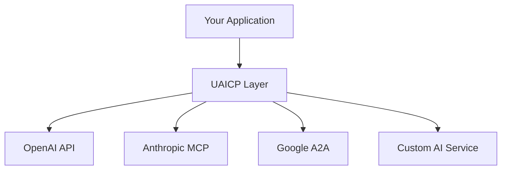

# Quick Start Guide

Get up and running with UAICP in minutes. This guide will walk you through the basics of understanding and using UAICP.

## What You'll Learn

- How UAICP fits into the AI ecosystem
- Core components and their roles
- Basic usage patterns
- Next steps for implementation

## Understanding UAICP

UAICP acts as a **universal bridge** between different AI systems and protocols. Instead of forcing everyone to use a single protocol, UAICP provides:



## Core Components Overview

### 1. Universal Discovery Mesh
**What it does**: Finds AI services across different protocols and platforms.

```typescript
// Example: Finding AI services that can handle text generation
const services = await discoveryMesh.findServices([
  { type: 'text-generation', quality: 'high' }
]);
```

### 2. Protocol Translation Hub
**What it does**: Translates between different AI communication formats.

```typescript
// Example: Translate OpenAI format to MCP format
const translated = await translationHub.translateMessage(
  openAIRequest, 
  'openai', 
  'mcp'
);
```

### 3. Adaptive Router
**What it does**: Routes requests to the best available AI service.

```typescript
// Example: Route based on capabilities and performance
const result = await router.routeMessage(request, {
  priority: 'high',
  fallbackAllowed: true
});
```

### 4. Capability Negotiator
**What it does**: Matches your needs with available AI capabilities.

```typescript
// Example: Find compatible capabilities
const compatibility = await negotiator.negotiateCapabilities(
  requiredCapabilities,
  availableCapabilities
);
```

## Basic Usage Pattern

Here's how a typical UAICP interaction works:

### Step 1: Discover Services
```typescript
import { UAICP } from '@uaicp/client';

const uaicp = new UAICP();

// Find services that can handle your request
const services = await uaicp.discovery.findServices({
  capabilities: ['text-generation'],
  modalities: ['text'],
  quality: 'high'
});
```

### Step 2: Route Your Request
```typescript
// Send your request through UAICP
const response = await uaicp.send({
  type: 'text-generation',
  content: 'Explain quantum computing',
  options: {
    maxTokens: 500,
    temperature: 0.7
  }
});
```

### Step 3: Handle Response
```typescript
// UAICP handles all the protocol translation automatically
console.log(response.content); // Your AI-generated response
console.log(response.metadata.provider); // Which service actually handled it
```

## Real-World Example

Let's build a simple AI chat application that works with multiple providers:

```typescript
import { UAICP } from '@uaicp/client';

class AIChat {
  private uaicp: UAICP;
  
  constructor() {
    this.uaicp = new UAICP({
      // Configure discovery preferences
      discovery: {
        preferredProviders: ['openai', 'anthropic', 'local'],
        fallbackEnabled: true
      }
    });
  }
  
  async chat(message: string): Promise<string> {
    try {
      // UAICP automatically finds the best available service
      const response = await this.uaicp.send({
        type: 'chat-completion',
        messages: [{ role: 'user', content: message }],
        options: {
          stream: false,
          maxTokens: 1000
        }
      });
      
      return response.content;
    } catch (error) {
      // UAICP provides detailed error context
      console.error('Chat failed:', error.details);
      throw error;
    }
  }
}

// Usage
const chat = new AIChat();
const response = await chat.chat("What's the weather like?");
```

## Integration Examples

### With Existing OpenAI Code
```typescript
// Before: Direct OpenAI integration
const openai = new OpenAI({ apiKey: 'your-key' });
const response = await openai.chat.completions.create({
  model: 'gpt-4',
  messages: [{ role: 'user', content: 'Hello' }]
});

// After: UAICP integration (with fallbacks to other providers)
const uaicp = new UAICP();
const response = await uaicp.send({
  type: 'chat-completion',
  messages: [{ role: 'user', content: 'Hello' }],
  hints: { preferredProvider: 'openai' } // Optional
});
```

### With MCP Tools
```typescript
// UAICP can integrate with MCP tools seamlessly
const response = await uaicp.send({
  type: 'tool-use',
  tool: 'web-search',
  parameters: { query: 'UAICP documentation' },
  context: { source: 'mcp-compass' }
});
```

## What Makes UAICP Different

| Traditional Approach | UAICP Approach |
|---------------------|----------------|
| Lock-in to one provider | Multi-provider flexibility |
| Manual failover | Automatic routing & fallbacks |
| Protocol-specific code | Universal interface |
| Limited discovery | Cross-protocol discovery |
| Individual security | Unified security model |

## Next Steps

Now that you understand the basics, here's where to go next:

### 📖 Learn More
- [Full Specification](./specification) - Deep dive into UAICP's architecture
- [Integration Guides](../integration-guides) - Platform-specific implementations
- [Examples](../examples) - Real-world usage patterns

### 🛠️ Start Building
- [JavaScript SDK](https://github.com/UAICP/uaicp-js) - For web and Node.js
- [Python Client](https://github.com/UAICP/uaicp-python) - For Python applications
- [Reference Implementation](https://github.com/UAICP/reference-impl) - Complete example

### 🤝 Get Involved
- [Join Discussions](https://github.com/UAICP/uaicp_specification/discussions) - Ask questions
- [Report Issues](https://github.com/UAICP/uaicp_specification/issues) - Help improve UAICP
- [Contribute](../governance/contributing) - Add to the specification

## Need Help?

- 💬 [Community Forum](/community) - Get help from other developers
- 📧 [GitHub Discussions](https://github.com/UAICP/uaicp_specification/discussions) - Technical questions
- 🔧 [Implementation Help](../integration-guides) - Platform-specific guidance

Ready for the deep dive? Check out the [complete specification](./specification) next!
